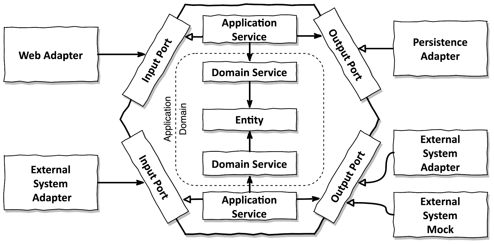

# Actualizar a versión más Java, Spring y librerías

Como primera mejora del proyecto actual propongo actualizar tanto la versión de Java como Spring junto con las posibles librerías de las que se haga uso en el proyecto. Esto es debido a que actualmente el proyecto está utilizando la versión 8 de Java, la cual ya no tiene soporte por parte de Oracle, y la versión 2.1.4 de Spring Boot, la cual también es una versión antigua, lo cual conlleva riesgos de seguridad y de mantenibilidad del proyecto.

> Este cambio se puede realizar siempre que no utilicemos librerías que no sean compatibles con las versiones más recientes de Java y Spring.

Para realizar los cambios comentados, modificamos el fichero [pom.xml](pom.xml) con las siguientes modificaciones:

### Actualización de la versión de Java a la 21

```xml
<properties>
  <java.version>21</java.version>
</properties>
```

La versión 21 de Java es la última versión LTS, la cual tiene soporte por parte de Oracle hasta septiembre de 2031. Al actualizar de Java 8 a Java 21 obtenemos todo tipo de mejoras que se han ido añadiendo en las diferentes versiones a partir de la 8, como por ejemplo:

- Mejoras de rendimiento y seguridad de la JVM.
- `Virtual Threads`, que permiten una mejor gestión de los hilos de ejecución.
- `Text blocks`, que permiten escribir cadenas de texto de manera más legible. Echar un vistazo al campo `description` en [`com.idealista.application.AdQueryServiceImplTest.relevantAd`](src/test/java/com/idealista/application/AdsServiceImplTest.java)
- Mejoras en el manejo de Streams.
- Mejoras en la API de Collections.
- Inferencia de tipos con el operador `var`, lo cual hace que el código sea más limpio y fácil de leer.

### Actualización de la versión de Spring Boot a la 3.4.2
```xml
<parent>
  <groupId>org.springframework.boot</groupId>
  <artifactId>spring-boot-starter-parent</artifactId>
  <version>3.4.2</version>
  <relativePath/>
</parent>
```

# Estructura del proyecto / Clean Architecture



Basándome en mi experiencia hasta la fecha trabajando con clean/hex architecture, junto con la reciente lectura del libro [Get Your Hands Dirty on Clean Architecture (2nd edition)](https://amzn.eu/d/8YGvn3e), he decidido realizar los siguientes cambios en la estructura del proyecto:

- `infrastructure` -> `adapter`: En la arquitectura hexagonal, los adaptadores son los encargados de conectar el dominio con el exterior. Por ello, he decidido renombrar el paquete `infrastructure` a `adapter` para seguir la nomenclatura de la arquitectura hexagonal. Esto a su vez ayuda a tener una subdivisión de paquetes para indicar qué adaptadores son de entrada y cuáles de salida.
  - Se cambia también `api` por `rest` ya que es más descriptivo. `api` podría ser línea de comandos, websockets, gRPC, etc.

- `application.port`: He creado el paquete `application.port` para tener una mejor organización de los puertos de la aplicación. En este paquete se encuentran las interfaces que definen los puertos de entrada y salida de la aplicación.
- Ahora mismo los servicios de dominio están devolviendo objetos de la capa `adapter`. Esto rompe completamente con lo que se entiende por arquitectura hexagonal. Si añadiéramos un nuevo adaptador como por ejemplo gRPC, este nuevo adaptador dependería del objeto que se devuelve para otro adaptador, lo cual no es correcto. Por ello, se debería devolver objetos de la capa de dominio y ser los adaptadores los encargados de mapear dichos objetos a los objetos que necesiten. Ver `com.idealista.application.domain.service.AdQueryServiceImpl.findPublicAds`

# Mejoras en el código

## Inyección de dependencias

`@Autowired`: Se ha cambiado la anotación `@Autowired` por inyección de dependencias mediante constructor en las clases que tienen dependencias, ya que es una buena práctica utilizar la inyección de dependencias por constructor en lugar de por campo. Esto tiene varias ventajas:
  - Se asegura que las dependencias son inyectadas en el momento de la creación del objeto, evitando posibles errores de `NullPointerException` en tiempo de ejecución.
  - Facilita la escritura de tests unitarios, ya que se pueden pasar mocks de las dependencias en el constructor.
  - Hace que las clases sean inmutables, ya que una vez inyectadas las dependencias en el constructor, no se pueden cambiar.


## Refactor nombres de clases

- `Main` -> `AdRankingApplication`: Por convención, el nombre de la clase principal de una aplicación Spring Boot debe ser el nombre de la aplicación seguido de la palabra `Application`.
- `AdsController` -> `AdController`: Se ha cambiado el nombre de la clase `AdsController` a `AdController` para seguir la convención de nombres de los controller, ya que un controller es para gestionar un recurso o una lista de ellos y por convención se suele usar el singular.

## REST
- En `AdController`, ya que todos los endpoints comparten la misma URL base `/ads`, se ha añadido la anotación `@RequestMapping("/ads")` a nivel de clase para evitar repetir la URL en cada método. A su vez se ha editado URL base añadiéndole el sufijo `/api`, ya que es el controller de una api rest, por convención se suele poner dicho sufijo. También se añade la versión `/v1`, para facilitar futuras actualizaciones de la API.

## Rendimiento
- `AdController.calculateScore`: Como posiblemente el cálculo de scores sea un proceso pesado, se debería hacer en un hilo aparte. Si no, bloqueará el hilo principal y cabe la posibilidad de que se cumpla antes el timeout de la petición y el usuario no reciba la respuesta correcta aunque en realidad la petición en el servidor se esté procesando correctamente.
- **Paginar resultados**: Tal como está el código ahora mismo, si tenemos muchos anuncios, la respuesta de la API será muy grande y puede ser un problema para el cliente. Por ello, se debería implementar paginación en la API para que el cliente pueda solicitar un número determinado de anuncios por página.
- `com.idealista.application.domain.usecase.CalculateScoreUseCase.invoke`: No debería ser necesario recuperar todos los anuncios, únicamente aquellos que no tengan un score
calculado o que hayan sido modificados desde la última vez que se calculó el score.
- `com.idealista.application.domain.usecase.CalculateScoreUseCase.invoke`:
```java
adPersistenceOutPort
        .findAllAds()
        .forEach(this::calculateScore);
```
Para mejorar el rendimiento se podría paralelizar el cálculo de los scores de los anuncios.

- `com.idealista.application.domain.usecase.CalculateScoreUseCase.calculateScore`: Quizás se podría añadir un cron que cada cierto tiempo ejecute el cálculo de scores, así evitamos tener que calcular el score de los anuncios en cada petición.

## Otras mejoras
- `enum`: Para esto no hay un consenso como tal, pero a nivel de gusto personal me gusta tener los enums como propiedad clase, así se sabe claramente a qué hace referencia dicho enum.

- `Builder Pattern`: Se ha utilizado el patrón Builder para la creación de objetos que tienen muchos atributos y algunos de ellos son opcionales. Esto hace que la creación de objetos sea más legible y fácil de entender. También nos evita tener que crear múltiples constructores con diferentes combinaciones de atributos. Algunos sitios donde sería beneficioso utilizarlo:
  - `com.idealista.adapter.out.persistence.InMemoryPersistenceAdapter#mapToDomain(com.idealista.adapter.out.persistence.AdEntity)`
  - `com.idealista.adapter.out.persistence.InMemoryPersistenceAdapter.mapToPersistence(com.idealista.application.domain.Ad)`

- `com.idealista.adapter.out.persistence.InMemoryPersistenceAdapter`: Lo sustituiría por un adapter que haga uso de un Repository de Spring Data JPA junto con la base de datos que se usa en producción. Con esto nos aseguramos de que nuestra aplicación se comporta de la misma manera en producción que en desarrollo. A su vez, para facilitar el desarrollo local, se puede hacer uso de docker. Para ello en el repositorio se podría incluir un fichero docker-compose.yml que contenga la infraestructura que el servicio necesita (haciendo uso de mocks tipo Wiremock para servicios de terceros).
- `com.idealista.application.domain.usecase.CalculateScoreUseCase.calculateScore`: Ahora mismo este método es muy largo y muy difícil de mantener en el futuro. Este método podría estar dentro de la clase Ad, ya que el modelo de dominio tiene lo necesario para poder calcular el score. Ver `com.idealista.application.domain.AdRefactor` y sus clases hijas.
- La clase `com.idealista.application.domain.Constants` la veo innecesaria y redundante. No le veo valor a tener unas constantes con el nombre de cada número.

# Uso de librerías/herramientas que facilitan el desarrollo/mantenibilidad del proyecto

- **Lombok**: Código menos verboso y más limpio.
- **Liquibase**: Para la gestión de la base de datos. Nos permite tener un control de los cambios que se realizan en la base de datos y nos facilita la creación de scripts de migración.

# Testing
Añadiría tests de aceptación usando lenguaje Gherkin + librería Cucumber. Estos tests se definirían junto con el PO/Business Analyst y deben pasar para dar una historia de usuario por válida.

# API First -> OpenAPI
Aplicaría el principio de API First, es decir, definiría la API antes de empezar a desarrollar. Para ello, se puede utilizar OpenAPI, que nos permite definir la API en un fichero YAML o JSON. Una vez escrita dicha especificación, se le presentaría al cliente interesado en consumir nuestra api (frontend, otros microservicios) y una vez aceptada la especificación procederíamos a escribir código.

# Seguridad
- **Spring Security**: Para la autenticación y autorización de los usuarios. Ahora mismo cualquiera puede acceder a los endpoints de la API sin necesidad de autenticarse.

# Logging y monitorización
- **Spring Boot Actuator**: Para monitorizar la aplicación en producción.

# Cambios menos importantes
- Actualización de `.gitignore`
    - La versión actual del fichero `.gitignore` no ignora archivos como por ejemplo archivos generados por el sistema operativo, archivos temporales, etc. Para generar un archivo `.gitignore` más completo, se puede utilizar la herramienta [gitignore.io](https://www.toptal.com/developers/gitignore).
- Seguir un estilo de código consistente para evitar cambios innecesarios en el código y que dificultan los code reviews.
- Tanto la documentación como los comentarios en el código deben estar en inglés, ya que es el idioma universal en el mundo de la programación.